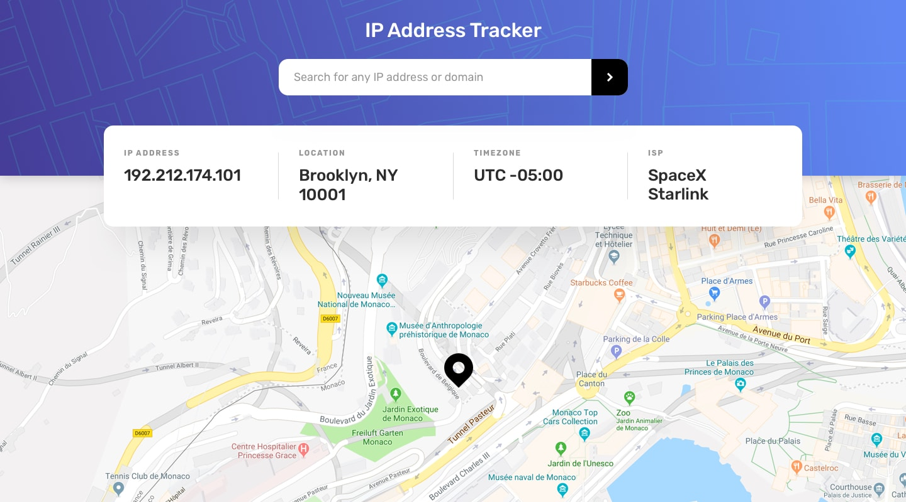

<div align="center">

  
  <h1>IP Address Tracker</h1>

  <p>
    A polished solution to the Frontend Mentor IP Address Tracker challenge, built with React, Vite, Tailwind CSS, and modern form validation.
  </p>

  <p>
    
    
    
    
  </p>

  <h4>
    <a href="https://ipaddresstracket-kv.netlify.app/" target="_blank" rel="noopener noreferrer">🚀 Live Demo</a>
    <span> · </span>
<!-- VARIABLE_SECTION_1_START -->
    <a href="https://github.com/itskaushikverma/frontend-mentor/tree/main/ip-address-tracker">📁 Repository</a>
<!-- VARIABLE_SECTION_1_END -->
    <span> · </span>
    <a href="https://www.frontendmentor.io/solutions/ip-address-tracker-main-fSC5EfIAz3">🎯 Challenge</a>

  </h4>

</div>

## 📚 Table of Contents

- [About the Project](#about-the-project)
- [Screenshots](#screenshots)
- [Tech Stack](#tech-stack)
- [Features](#features)
- [Getting Started](#getting-started)
- [Available Scripts](#available-scripts)
- [Project Structure](#project-structure)
- [Deployment](#deployment)
- [Contributing](#contributing)
- [License](#license)
- [Contact](#contact)

<a id="about-the-project"></a>

## ✨ About the Project

This app calculates a user's exact age in years, months, and days based on a provided birth date.

The project focuses on:

- ✅ Clean, field-level validation
- 📱 Responsive UI behavior across devices
- 🎬 Smooth transitions and number animation
- ♿ Accessible form interactions with clear error messaging

<a id="screenshots"></a>

## 📸 Screenshots

<div align="center">
  
</div>

<a id="tech-stack"></a>

## 🛠️ Tech Stack

- ⚛️ React 19
- ⚡ Vite 8
- 🎨 Tailwind CSS 4
- 🧾 React Hook Form
- ✅ Zod
- 🎞️ Motion
- 🧹 ESLint + Prettier

<a id="features"></a>

## 🌟 Features

Users can:

- View the optimal layout for each page depending on their device's screen size
- See hover states for all interactive elements on the page
- See their own IP address on the map on the initial page load
- Search for any IP addresses or domains and see the key information and location
- Handle missing or invalid API keys gracefully with a custom input fallback

<a id="getting-started"></a>

## 🚀 Getting Started

### 📋 Prerequisites

- Node.js 18 or newer
- npm

### 💻 Run Locally

Clone the project:

<!-- VARIABLE_SECTION_2_START -->

```bash
git clone https://github.com/itskaushikverma/frontend-mentor.git
```

<!-- VARIABLE_SECTION_2_END -->

Move into the project folder:

```bash
cd age-calculator-app
```

Install dependencies:

```bash
npm install
```

Start the development server:

```bash
npm run dev
```

<a id="available-scripts"></a>

## 📜 Available Scripts

- npm run dev: start the local development server
- npm run build: build the app for production
- npm run preview: preview the production build locally
- npm run lint: run ESLint checks

<a id="project-structure"></a>

## 🧩 Project Structure

```text
src/
  App.jsx
  main.jsx
  index.css
  assets/
    svg/
  components/
    InfoCard.jsx
    MapSection.jsx
    MotionWrapper.jsx
    TopBanner.jsx
```

<a id="deployment"></a>

## 🌐 Deployment

This project is deployed on Netlify:

- <a href="https://ipaddresstracket-kv.netlify.app/" target="_blank" rel="noopener noreferrer">https://ipaddresstracket-kv.netlify.app/</a>

To create a production build locally:

```bash
npm run build
```

<a id="contributing"></a>

## 🤝 Contributing

Contributions, issues, and feature suggestions are welcome.

If you would like to contribute:

- fork the repository
- create a feature branch
- commit your changes
- open a pull request

<a id="license"></a>

## 📄 License

[](LICENSE)

This project is licensed under the MIT License — see the [LICENSE](LICENSE) file for details.

<!-- VARIABLE_SECTION_3_START -->

<a id="contact"></a>

## 👤 Author

<div align="center">
  
  
  <h3>Kaushik Verma</h3>
  
  <p><em>Building AI tools that turn long documents into clear decisions.</em></p>

[](mailto:kaushikverma321@gmail.com)
[](https://www.kaushikverma.com)
[](https://github.com/itskaushikverma)
[](https://www.linkedin.com/in/itskaushikverma)
[](https://x.com/SilentK68296830)

  <p>Open to product feedback, collaboration, and thoughtful conversation.</p>
</div>

<div align="center">
  <p>If you found this project helpful, please consider giving it a ⭐️</p>
  
  [](https://github.com/itskaushikverma/frontend-mentor)
</div>

<!-- VARIABLE_SECTION_3_END -->
